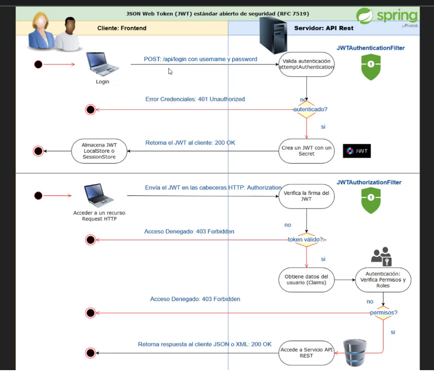

# CONTINUACION DEL CURSO COMPLETO DE SPRING & SPRING BOOT

# CONTINUAMOS CON EL SIGUIENTE PROYECTO, IMPLEMENTACION DE JWT (JSON WEB TOKEN) PARA SEGURIDAD

# Seccion 23 - Spring Security: Autenticacion basada en JWT (JSON Web Token)

## Sistema de Login, autenticacion, roles.. etc.

Trabajamos con ROLES, usuarios con password y demas. Dentro de la app, tenemos todo el front y el backend, trabajando
con controladores, logica de negocio.. etc. Cuando tenemos toda la app dentro del mismo 'src' utilizamos SESIONES (lo + tipico)

Otra alternativa.. TOKENS! Separamos nuestra app cliente, con el backend, el api rest. Dos apps independientes.
JWT -> JSON WEB TOKEN: Usuario envia codigo alfanumerico al server y el server se encarga de descifrar y validar!
EVITAMOS guardar SESIONES EN NUESTRO SERVER, hacer mas ligera nuestra app.

JWT agrega mas seguridad a nuestra app, a traves de TOKENS. 

Sesion con TOKENS -> Stateless, gran diferencia con las sesiones convencionales que son Statefull
No mantiene una persistencia. Cada vez que queremos ingresar debemos enviar nuestro token.

Viendo mas en profundidad los JWT, aclaremos esto que es importante:
    -> Nunca debemos guardar informacion SENSIBLE en el PAYLOAD del JWT, ya que puede ser, facilmente, manipulable
    a traves de JS basico nativo. Cuidado con esto!

## Leccion 1 - Creando el proyecto JWT y configuraciones

    - Dentro del POM.XML cambiamos el artifactID del proyecto, name, description.
    - Agregamos la dependecia de JWT en el proyecto, dentro del pom.xml -> Buscamos la libreria en la pagina de JWT
    - Dentro de la config de SpringSecurity (SpringSecurityConfig class) y adatamos la configuracion para poder trabajar
    con JWT.
        -> La idea es convertir dicha configuracion para que NO TRABAJE CON SESIONES, sino con la forma SIN ESTADO (STATELESS)
        . Para esto, desahibilitamos la proteccion csrf con -> csrf().disable();
        . Y dentro del layout y del login quitamos el input que enviaba como valor el csrf para las sesiones.
            - Esto: <input type="hidden" th:name="${_csrf.parameterName}" th:value="${_csrf.token}" />
        
        . Configurar en SpringSecurity habilitando en el sesion manager como SIN ESTADO por sobre el uso de sesiones:
            -> .sessionManagement().sessionCreationPolicy(SessionCreationPolicy.STATELESS);

    - Una vez configurado esto veremos que al iniciar el proyecto y querer iniciar sesion, la app "iniciara la sesion"
    pero estaria mal, ya que al colocar el STATELESS, el manejo de sesiones esta desactivado por lo que no guarda ni
    procesa los datos en dichas sesiones. En conclusion, no podemos ingresar a ninguna funcion de la app.

## Leccion 2 - Proteger rutas en nuestro API REST

    - Levantamos el projecto y testearemos la api rest (ClienteRestController) en POSTMAN.
    - Cuando realizamos la peticion GET en postman para listar los clientes desde el REST nos tirara el HTML, no el JSON
        -> Esto se debe a que tenemos configurador el LOGIN en SpringSecurity, de forma auto, cada pagina que requiera
        una AUTENTICACION (como listar) siempre dirigira al formulario LOGIN 
        -> Estamos llamando bien al endpoint del api rest pero como tiene seguridad, dirige al FORMULARIO de LOGIN

    - Debemos deshabilitar el formulario LOGIN de nuestro SpringSecurity
    - La idea es que NO muestre el formulario de LOGIN, sino un 'not authorized' mensaje a realizar la consulta o 403 Forbbiden
    - Entonces, es ideal tener por separado nuestra aplicacion REST de nuestra parte WEB con sesiones, etc.
    - DESHABILITAMOS el formulario LOGIN de nuestros filtros de SpringSecurity hasta el error handling 403
        -> Veremos que nos da un error 403, acceso denegado.

## Leccion 3 - Creando la clase filtro JWTAuthenticationFilter

    - Necesitamos un FILTRO que se encargara de la autenticacion, mediante REQUEST, realizara el LOGIN segun las credenciales
    - Dentro del proyecto, creamos un package nuevo (dentro de auth) -> filter
    - Dentro de filter, creamos nuestra clase FILTRO (JWTAuthenticationFilter) para el manejo de JWT
    - Ver implementacion de la clase con sus herencias y demas..
        -> Heredamos de 'UsernamePasswordAuthenticationFilter' : Autenticar mediante credenciales.

    - PARA QUE FUNCIONE EL FILTRO LO TENEMOS QUE REGISTRAR! -> EN la configuracion lo hacemos despues del and()..
    - Implementamos un addFilter para agregar nuestro filtro de JWT le enviamos el authenticacionManager

    - Una vez implementado el JWTAuthenticationFilter, probamos con un request POST dentro del POSTMAN para validar
    un inicio de sesion.

## .. Esta seccion queda sin actualizar de momento, se avanzara luego de determinadas actualizaciones con SpringBoot y JWT

    

